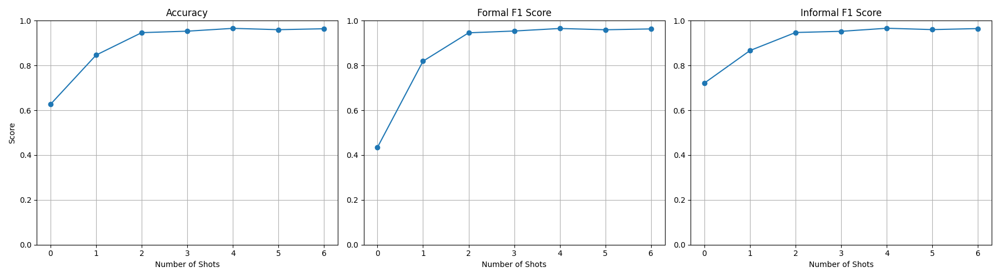

# Goal 

The goal is to create an evaluation system for a formality detection model.

# Dataset

To ensure a fair evaluation, I decided to create my own custom dataset, rather than relying on well-known formality datasets that many language models have likely seen during pretraining. Using such public benchmarks might lead to overestimated results.

## Dataset Composition
I constructed a binary classification dataset for formality detection, combining data from six different sources:

Formal samples were collected from:
- *CNN/DailyMail* – news articles;

- *XSum* – official summaries of news;

- *EURLEX* – legal documents from the European Union.

Informal samples were collected from:
- *TweetEval* – tweets;

- *Reddit* – discussions and posts;

- *EmpatheticDialogues* – casual conversations meant to reflect everyday speech.

All datasets were loaded via the Hugging Face Hub and then cleaned and preprocessed.

## Preprocessing
To reduce noise, I applied the following preprocessing steps:

- Remove HTML artifacts (e.g. `&nbsp;`, `<br>`, etc.);

- Strip HTML tags;

- Normalize whitespace by removing extra spaces and tabs (formal texts usually avoid such inconsistencies, but we don't want it to be a clue for classification)

- Limit repeated characters, e.g.: "aaaaaaaaaaa" → "aaaa", "!!!!!!!!!!!!" → "!!!!!" It will not change the formality (formal texts still may have a maximum of three repeated characters).

- Filter out very short texts, which are often headlines, author names, or otherwise irrelevant.

## Notes
- Unlike many existing datasets, the samples in this dataset are **not truncated** — they may contain over **5,000 tokens** each. 
- Generating the dataset requires **significant memory and time**. For convenience, I provided the generated dataset. It contains 600 formal and 600 informal texts, this number can be changed in the dataset generation. 

# Approach

Several common approaches for Formality Classification are:

| Approach                          | Description                                                                                   |
|----------------------------------|-----------------------------------------------------------------------------------------------|
| **Rule- & lexicon-based**        | Handcrafted rules or wordlists (e.g., contractions, emojis, slang)   |
| **Classical ML**                 | Use features like n-grams, punctuation, TF-IDF; train models like SVM or Logistic Regression |
| **Word embeddings + classifier** | Represent text with word2vec/GloVe; use a simple classifier on top                           |
| **Fine-tuned transformers**      | Models like BERT fine-tuned on labeled formality data                |
| **Zero-/few-shot with LLMs**     | Use prompts with LLMs (e.g., GPT, LLaMA) without fine-tuning     |
| **Instruction-tuned LLMs**       | Models like FLAN-T5, LLaMA-Chat that better follow prompts; may be combined with the few-shot and CoT.         |
| **Style-transfer as classifier** | Reuse models trained to rewrite style (formal ↔ informal) for classification tasks.           |
| **Feedback-based training**      | Improve the classifier over time using user corrections or manual feedback.                   |

**We use zero-/few-shot prompting with LLMs**, specifically `LLaMA-3` (loaded via `Unsloth`).

We don’t perform any kind of training or fine-tuning — the model is used as-is. In each case, we formulate a prompt that describes the task and provides between 0 and 6 labeled examples (for a few-shot). We then ask the model to classify the next text as either "formal" or "informal". 

After generation, the model’s response is parsed using a simple heuristic:
- If the word “formal” is present and “informal” is not — we classify it as formal
- Otherwise — the label is informal

This logic can be adjusted depending on the application. For example, if it’s more important not to mistakenly label a formal text as informal, one may design the rules differently. Additional heuristics can also be applied to handle cases when both “formal” and “informal” appear in the response, or when neither label is present.

To speed up processing, we implemented batched evaluation. Additionally, we provide a non-batched version for clarity and easier understanding of the logic.

⚠️ Note:
>All input texts are truncated to fit within model limits. In our case, this worked well since the beginning of each text typically contained enough signals to determine its formality.
> However, for evaluating longer texts, this approach may be inappropriate. A better strategy would be to chunk the text, classify each chunk, and then aggregate the results.

# Metrics

The dataset is balanced and there is no task specificity, so I report and plot **Accuracy** and **F1-score**. In addition, I also calculate **Precision** and **Recall** for each class.

For clarity, I refer to:
- **"Formal Recall"** (Precision, F-1 score) as the standard Recall (Precision, F-1 score) when the positive class is "formal",
- **"Informal Recall"** (Precision, F-1 score) as the standard Recall (Precision, F-1 score) when the positive class is "informal".

Depending on the use case of the formality classifier, **different metrics may be more important**. For instance,

- **Formal Recall** becomes critical when generating tweets or informal messages — it's important not to misclassify a formal text as informal.
- **Formal Precision** is more relevant when generating legal or official documents — we want to ensure we don't mistakenly label informal content as formal.
- **Informal Recall** is important when the system must detect all informal messages — for example, in games or chat platforms where informal language triggers a specific response or action.
- **Informal Precision** matters when labeling or filtering text for tone-sensitive applications, like writing assistants or educational platforms. If we incorrectly flag a formal sentence as informal, the system may offer unnecessary or misleading corrections.

# How to run the experiments
Use the notebook in the notebooks/ folder:
```notebooks/few_shot_formality_classification.ipynb```

You can open and run it directly in Google Colab — it’s self-contained and easy to follow.

# Results
We obtained quite promising results by just prompting the LLM correctly! The figure below shows how the metrics change depending on the number of shots used in the prompt:


In the table form,
| Shots | Accuracy | Formal F1 | Informal F1 |
|:-----:|:--------:|:---------:|:-----------:|
| 0     | 0.6267   | 0.4343    | 0.7214      |
| 1     | 0.8465   | 0.8193    | 0.8667      |
| 2     | 0.9466   | 0.9459    | 0.9473      |
| 3     | 0.9532   | 0.9539    | 0.9525      |
| 4     | 0.9657   | 0.9652    | 0.9662      |
| 5     | 0.9598   | 0.9595    | 0.9602      |
| 6     | 0.9640   | 0.9632    | 0.9647      |

My realization (using ```unsloth/llama-3-8b-bnb-4bit```, ```batch_size=14```, on a dataset of 1200 examples) required the following processing time:
| Number of Shots | Execution Time |
|------------------|----------------|
| 0                | 06:19          |
| 1                | 06:59          |
| 2                | 07:46          |
| 3                | 08:12          |
| 4                | 09:17          |
| 5                | 10:12          |
| 6                | 11:04          |

As we can see, even providing the model with just a single example significantly improves the metrics compared to giving none, while only slightly increasing the processing time. A performance plateau is observed at around 4 examples — this seems to be the most efficient point in terms of both metric gains and execution time.


